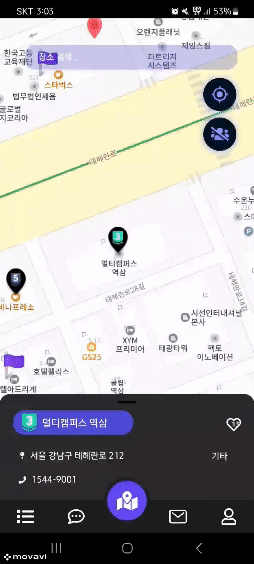
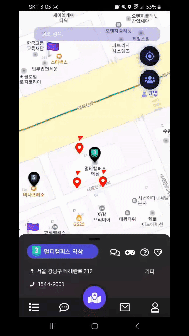
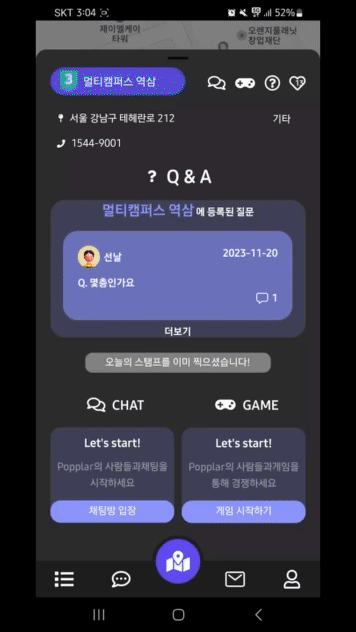
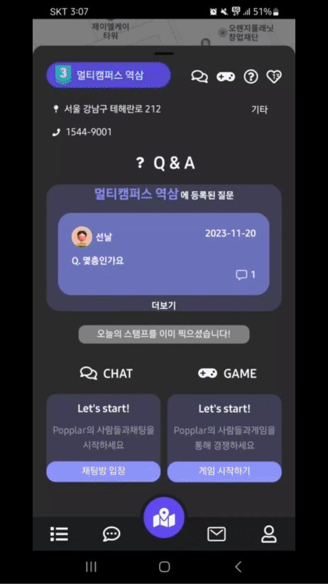
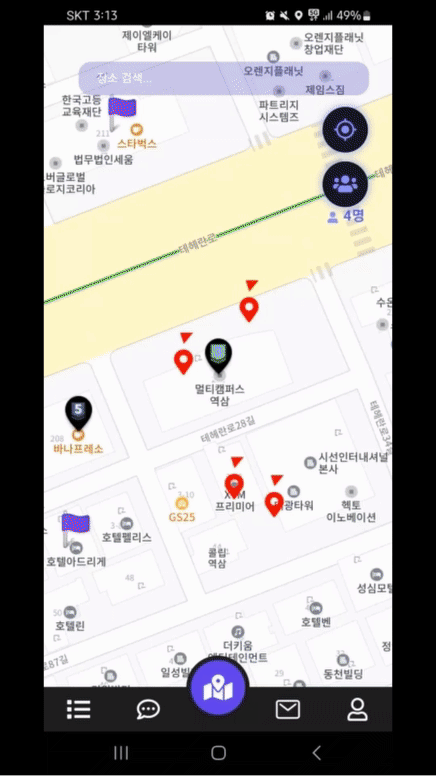
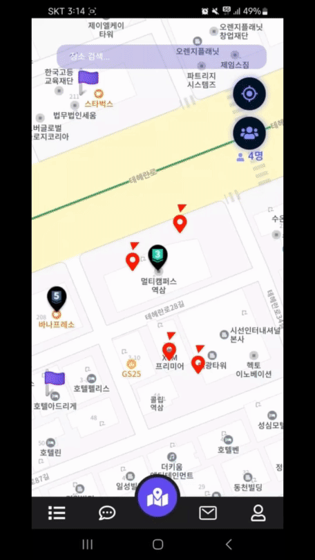
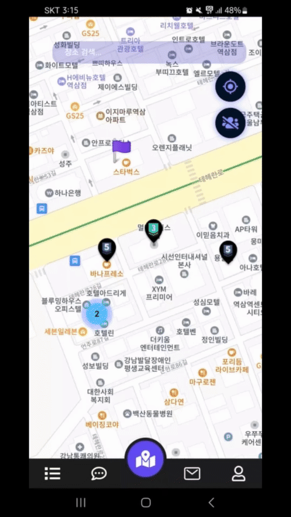

# Popplar : 위치 기반 실시간 소셜 모바일 앱 서비스

	

## 📌 기획 배경
국내 핫플레이스들에 대한 인기가 높아진 만큼 길어진 웨이팅, 핫플레이스에서 같은 공간에서 지루한 대기 시간을 보내는 사람들끼리 서로 익명으로 대화하면서 핫플에 대한 정보도 공유하고, 게임도 하면서 즐겁게 웨이팅 시간을 보낼 수 있는 서비스.

	

	> <a href="https://play.google.com/store/apps/details?id=com.popplar.myapplication&hl=ko-KR"> 지금 바로 플레이스토어에서 이용하기</a> <
	

 

## 📚 개발 기간

	
개발 기간 : 2023.10 - 2023.11 (6주)

 

## 🎉 프로젝트 소개
🪐**위치 기반 실시간 소셜 모바일 앱 서비스** 🪐  
내 주변 장소가 궁금한 여행자🚩, 익명의 사용자와 자유롭게 소통하고 싶은 사람들🤸‍♀️을 위해 **POPPLAR**가 탄생했습니다! **POPPLAR**를 통해 아지트를 방문하고 즐거운 시간을 함께 나누세요!

 

## ✨ 주요 기능

 <table>
    <tr>
      <td align="center" style="font-weight: bold; font-size: 18;">로그인 & 지도</td>
      <td align="center" style="font-weight: bold; font-size: 18;">아지트 입장하기</td>
      <td align="center" style="font-weight: bold; font-size: 18;">방문 스탬프 & 게임</td>
    </tr>
    <tr>
      <td align="center"></td>
      <td align="center"></td>
      <td align="center"></td>
    </tr>
	   
	<tr>
      <td align="center">소셜 로그인 후 아지트 정보가 포함된 지도 페이지로 이동</td>
      <td align="center">아지트와 사용자의 거리를 측정해 500미터 이내에 있다면 입장하기 버튼 활성화, 500미터 밖에 있다면 입장 불가</td>
      <td align="center">하루에 한번 방문 스탬프 기록 (방문 스탬프 누적 기록을 통해 아지트 레벨이 상승) / 두 가지 미니게임 점수를 합산해 가장 높은 점수를 달성한 오늘의 정복자 표시</td>
    </tr>
</table>
<table>
    <tr>
      <td align="center" style="font-weight: bold; font-size: 18;">QNA & 질문하기 & 채택하기</td>
      <td align="center" style="font-weight: bold; font-size: 18;">채팅방 입장 후 채팅하기</td>
      <td align="center" style="font-weight: bold; font-size: 18;">주변 사용자에게 쪽지 보내기 & 보낸 쪽지함, 받은 쪽지함</td>
    </tr>
    <tr>
      <td align="center"></td>
      <td align="center"></td>
      <td align="center"></td>
    </tr>
    <tr>
      <td align="center" style="font-weight: bold; font-size: 18;">선택된 장소에 대해 자유롭게 질문하고 답변 가능. 질문자는 원하는 답변 채택 가능</td>
      <td align="center" style="font-weight: bold; font-size: 18;">입장하기 후 실시간 아지트별 채팅방 입장 가능, 특정 사용자 차단 가능</td>
      <td align="center" style="font-weight: bold; font-size: 18;">아지트 사용자 마커를 선택해 특정 사용자에게 쪽지 발송 가능. 받은 쪽지를 확인하고 답장 가능</td>
    </tr>
</table>
<table>
    <tr>
      <td align="center" style="font-weight: bold; font-size: 18;">마이페이지 (업적 / 내 정보 수정)</td>
      <td align="center" style="font-weight: bold; font-size: 18;">전체 아지트 리스트 & 카테고리별</td>
      <td align="center" style="font-weight: bold; font-size: 18;">장소 검색 & 아지트 등록</td>
    </tr>
    <tr>
      <td align="center"></td>
      <td align="center"></td>
      <td align="center"></td>
    </tr>
    <tr>
      <td align="center" style="font-weight: bold; font-size: 18;">아지트 방문에 따른 장소 카테고리별 업적 갱신. 사용자 닉네임과 이미지 수정 가능</td>
      <td align="center" style="font-weight: bold; font-size: 18;">전체 아지트 리스트 확인 가능. 장소 카테고리별 필터와 검색을 통해 원하는 아지트를 편리하게 찾을 수 있음</td>
      <td align="center" style="font-weight: bold; font-size: 18;">장소 검색을 통해 아직 아지트 등록되지 않은 장소를 찾고 새로운 아지트로 등록 가능</td>
    </tr>
 </table>

 

## 🔧 기술 스택

	<h4>Back-end</h4>
	

		
		
		
		
		
		
		
		
		
		
	

	<h4>Front-end</h4>
	

		
		
		
		
		
		
	

	<h4>Infra</h4>
	

		
		
		
	

	<h4>Tools</h4>
	

		
		
		
		
		
		
	

	

 

## ⚙️ 인프라 구조

	

 

## 👩‍💻 팀원 소개
  <table align="center">
		<h3 align="center">Back-end</h3>
    <tr>
      <td align="center"></td>
      <td align="center"></td>
      <td align="center"></td>
    </tr>
    <tr>
      <td align="center">오준석</td>
      <td align="center">오성락</td>
      <td align="center">김민석</td>
    </tr>
    <tr>
      <td align="center"><a href="https://github.com/joonsuk12" target="_blank">@joonsuk12</a></td>
      <td align="center"><a href="https://github.com/OhSeongRak" target="_blank">@OhSeongRak</a></td>
      <td align="center"><a href="https://github.com/pxxnxx" target="_blank">@pxxnxx</a></td>
    </tr>
	</table>
	<table align="center">
		<h3 align="center">Front-end</h3>
    <tr>
      <td align="center"></td>
      <td align="center"></td>
      <td align="center"></td>
    </tr>
    <tr>
      <td align="center">서동훈</td>
      <td align="center">팽지우</td>
      <td align="center">박재은</td>
    </tr>
    <tr>
      <td align="center"><a href="https://github.com/gns9541" target="_blank">@gns9541</a></td>
      <td align="center"><a href="https://github.com/JiwooPaeng" target="_blank">@JiwooPaeng</a></td>
      <td align="center"><a href="https://github.com/JPark11" target="_blank">@JPark11</a></td>
    </tr>
  </table>
